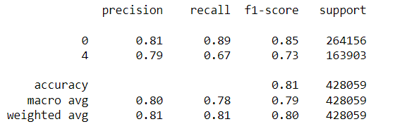

# Sentiment Analysis Project
# Overview

This repository contains a sentiment analysis project based on a dataset sourced from Kaggle. The goal of the project is to analyze and predict the sentiment of tweets as either positive or negative.

## Dataset

The dataset for this project was taken from the following Kaggle link:

https://www.kaggle.com/datasets/abhi8923shriv/sentiment-analysis-dataset

Note: The dataset exhibited class imbalance, with a larger number of negative tweets compared to positive ones.

# Data Augmentation

To address the class imbalance, the following data augmentation techniques were applied:

### Synonym Replacement - 
Replacing words in the tweet with their synonyms.

### Back Translation - 
Translating a tweet into another language and then translating it back to the original language.

The nlpaug library was utilized for these augmentation techniques.

# Preprocessing

The following preprocessing steps were applied to the tweets before feeding them into the model:

1.Stop Word Removal - 
Removal of common words that do not add significant meaning to the content.

2.Lemmatization - 
Reducing words to their base or root form (e.g., "running" becomes "run").
Lowercasing - Transforming all words to lowercase.

## Data Split

The dataset was split into training and testing datasets, with the test dataset comprising 33% of the total data.

# Feature Engineering

For vector creation, a Count Vectorizer was employed with a max feature limit set to 2,000.

# Model
A Logistic Regression model was used to predict the sentiment of the tweets.

# Results
The results of the Logistic Regression model :

## Getting Started

1.Clone this repository.

2.Download the dataset from the provided Kaggle link.

3.Install the necessary libraries, especially nlpaug.

4.Run the preprocessing and feature engineering scripts in jupyter notebook.

5.Train and evaluate the model using the provided scripts.

## Contributors

Ali Arslan

## License

Standard open-source licenses apply. Please refer to the LICENSE file in the repository for more details.

Feel free to contribute, report issues, or make suggestions. Your feedback is always appreciated!